# JD 분석 - 데이터 사이언티스트(Data Scientist, DS)

## 내용 구성
1. 공고 목록
2. 스킬 / 업무 / 자격요건
3. 데이터 사이언티스트
4. 앞으로 더 리서치해볼 내용들
5. 참고 공고들 링크

---

## 1. 공고 목록
## 현재 올라가있는 채용 공고(잡플래닛, 사람인, 잡코리아 참고)

<!-- 인턴이나 신입을 뽑는지 확인 -->
1. 기업 이름(채용공고 이름)

2. 기업 간단 설명 : 어떤 기업이고, 어떤 제품, 서비스를 제공하는지에 대해서 인지하면 좋을 것 같아서

3. 공고 내 업무 내용, 자격 요건, 우대 사항

---

### ■ 경력 3년 이하
#### 1.인실리코젠(데이터 사이언티스트 신입/경력 채용)

기업 간단 설명 : 
- insilico 상에서 질병의 원인과 진단 및 치료 방법을 찾고, 새로운 기능의 종자를 발굴,  개개인에게 맞는 건강 솔루션을 찾고 제공

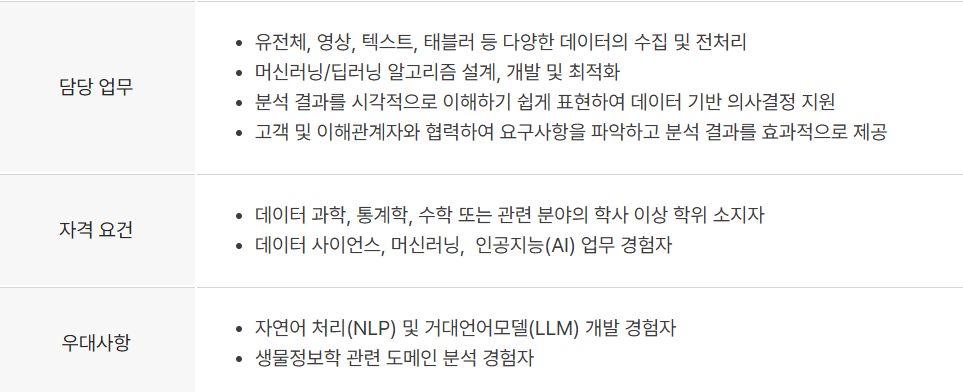

#### 2. 에이비팔공(Data Scientist)/ 잡플래닛    

기업 간단 설명 :
- 데이터 기반 마케팅 솔루션&컨설팅 회사
- 고객사의 마케팅과 프로덕트에서 더 좋은 의사결정이 이뤄질 수 있도록 자체 개발한 마케팅 성과 분석 솔루션 에어브릿지(Airbridge)와 다양한 글로벌 솔루션을 서비스

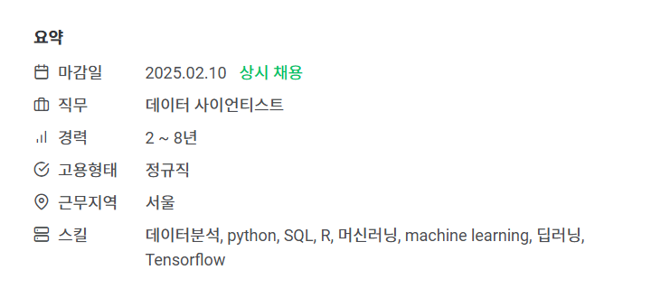
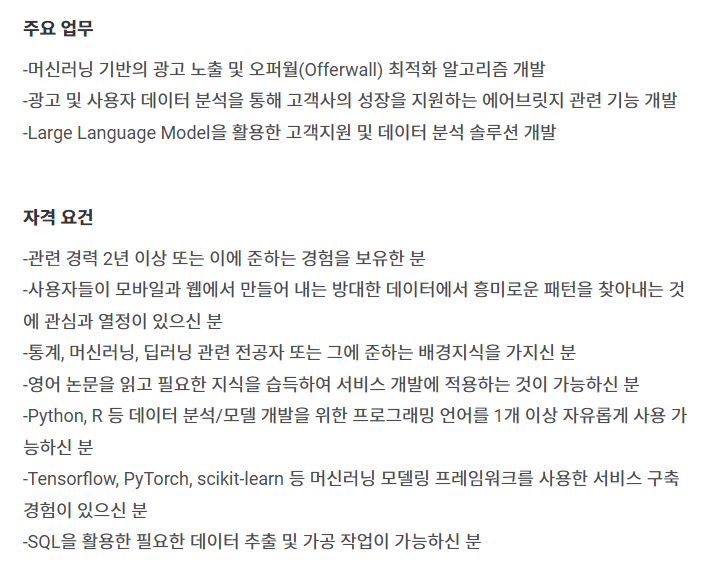
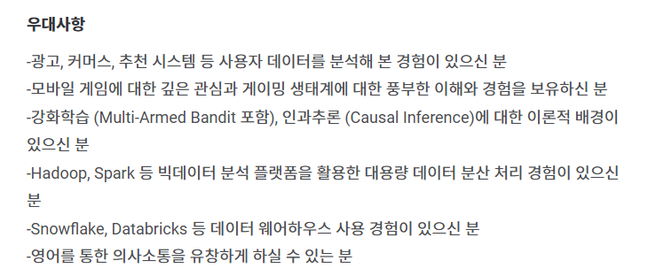

---

### ■ 경력 3년 이상~
#### 1. 바이오에이아이(AI/빅데이터 분야 데이터 사이언티스트)/ 잡플래닛       

기업 간단 설명 :    
- 인공지능 기술을 활용하여 신소재 및 신약 발견의 혁신을 선도하고자 하는 기업
- 에너지 및 바이오 산업 분야에서 인공지능 솔루션을 개발
- 환경친화적 그리고 경제적으로 효율적인 소재 개발을 추구

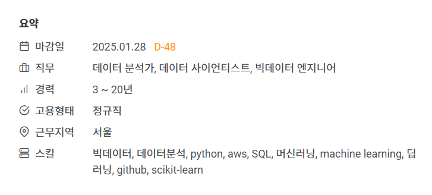 

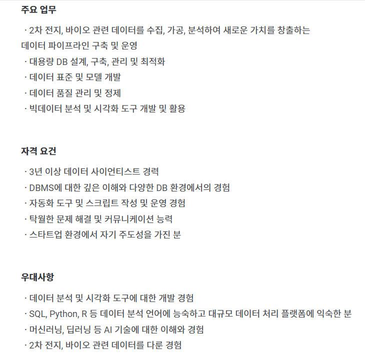

#### 2. 한국그린데이터(Data Scientist)    

기업 간단 설명 :    
- 지속가능한 에너지효율화에 대한 인간의 의식전환과 행동변화를 수반하는 효과적인 인사이트를 제공하는 플랫폼
- 비전문가도 활용 가능한 에너지효율화에 대한 의사결정을 지원

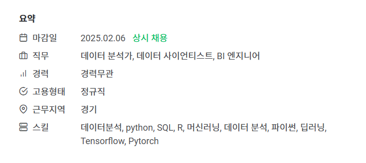
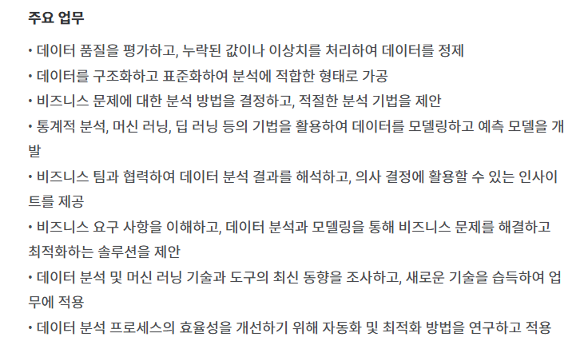
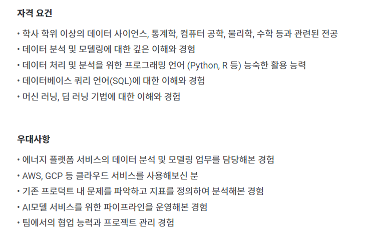

#### 3. 넥슨([인텔리전스랩스] 게임밸류에이션팀 데이터 사이언티스트)

기업 간단 설명 :
  - 인텔리전스랩스는 다양한 정보를 활용해 '빅데이터', '머신러닝,딥러닝','인공지능(AI)'기술과 공학적 사고를 통해 솔루션을 만들고 게임 사용자와 넥슨 구성원이 사용할 서비스를 제공하는 조직

.png)

---

### ■ 경력 5년 이상~
#### 1. 엑셈(데이터 사이언티스트(5년 이상))

기업 간단 설명 :    
- IT 인프라의 안정적인 운영과 발전을 견인하였으며 데이터베이스를 비롯한 시스템 전구간 성능관리에서 빅데이터, 인공지능, 클라우드까지 핸들링
- 엑셈의 주요 제품을 통해 기업정보시스템 전 구간의 성능관리와 분석이 가능

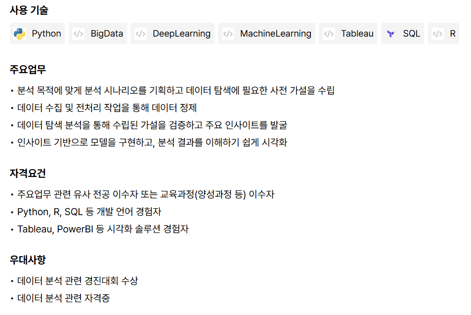

#### 2. 엠폴(앰폴 AI데이터 사이언티스트 모집합니다.)

기업 간단 설명 :    
- 보안 통합관제 플랫폼 전문기업
- AI, 물리보안, ICT 등 보안 융복합 분야의 최적의 기술 보유

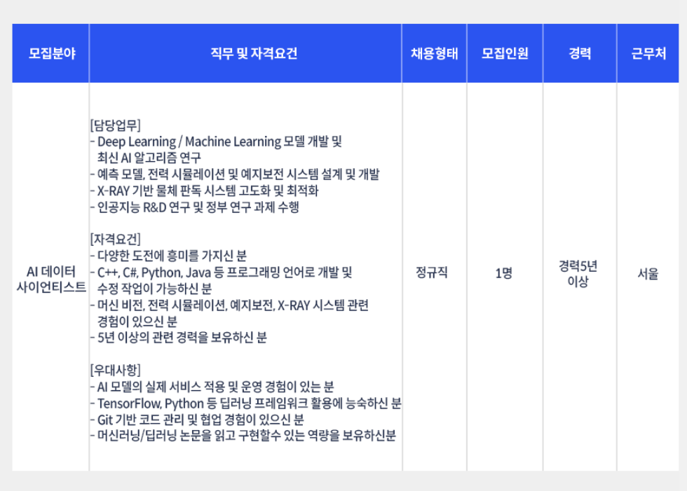

---

### 2. DS 핵심 스킬, 주요 업무, 자격 요건
1. 핵심 스킬 :
- 파이썬, SQL, 머신러닝, machine learning, 딥러닝, 데이터 분석,Tensorflow   

2. 주요 업무 :    
- 딥 러닝, 머신러닝 기반의 알고리즘 또는 모델 개발
- 데이터 표준 및 모델 개발
- 데이터 품질 평가 및 데이터를 정제
- 데이터를 분석 결과를 통해 의사 결정에 활용 가능한 인사이트 제공
- SQL을 활용한 데이터 추출 및 가공
- git을 통한 코드 관리 및 협업

3. 자격 요건 :    
- 특정 도메인에 관한 이해 및 열정
- 문제 해결 및 커뮤니케이션 능력
- 데이터 처리 및 분석을 위한 프로그래밍 언어(파이썬, R) 활용능력
- 데이터 분석 및 모델링에 대한 이해, 경험
- Tableau 등을 활용한 시각화 

---

### 3. 데이터 분석가란?
- 설명(in 코드잇) :    
데이터 분석, 통계, 기계 학습, 예측 모델링, 데이터 시각화 등 다양한 분야의 기술을 활용하여 데이터 기반의 문제를 해결하는 전문가!

#### 3-1. 그럼 다른 데이터 직업군과 차이가 무엇인가?
채용 공고를 보다보면 데이터 사이언티스트를 검색해보면 데이터 엔지니어,    
데이터 애널리스트 채용공고도 같이 보이게 되서 차이점이 무엇인가를 검색해보게 됨

데이터 엔지니어와 데이터 사이언티스트의 경우 :    
데이터 엔지니어는 데이터 분석가나 데이터 사이언티스트가 데이터를 활용해서 데이터 분석, 머신러닝 모델 구현 등을 편하게 할 수 있는 환경을 만들어줌

데이터 애널리스트와 데이터 사이언티스트의 경우 :    
데이터 애널리스트와 마찬가지로 데이터를 통해 인사이트를 도출한다는 면에서는 비슷함    
하지만 데이터 애널리스트는 데이터를 분석해 현재 의사결정에 도움을 주는 반면,    
데이터 사이언티스트는 데이터를 기반으로 미래를 예측한다는 측면에서 다름    
이를 위해 머신러닝이나 딥러닝 모델을 개발함

#### 즉, 데이터 애널리스트는 기획자 성향이 강한 반면, 데이터 사이언티스트는 연구자 성향을 가지고 있음

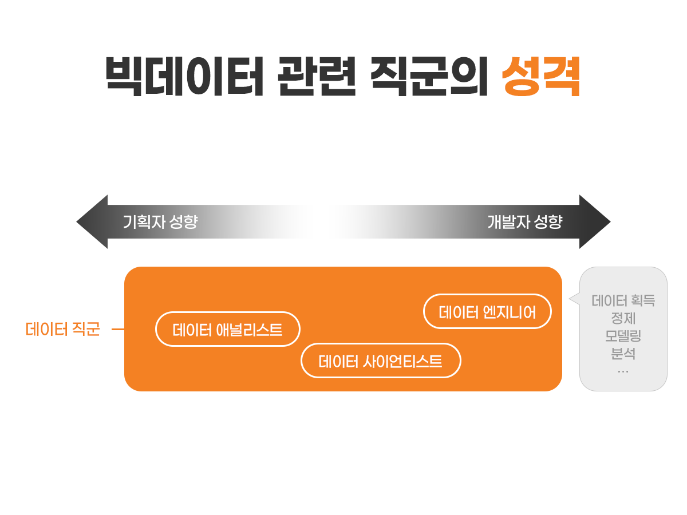

- #### 나에게 데이터 분석가란?    
특정 도메인의 데이터를 여러 기술(ex. 파이썬, 데이터 시각화, 머신러닝, 딥러닝 모델 등)을 통해 정제하고 분석하며, 이를 기반으로 문제를 해결, 또는 방향성을 제시하는 직업

---

### 4. 앞으로 더 리서치해볼 내용
- 특정 흥미 분야의 데이터를 다루는 기업의 채용 공고     
<!-- ㄴ (ex. 디스플레이, 반도체, 게임, 화장품 등) -->
- 데이터 사이언티스트에게 도움이 되는 자격증

<!-- 기획을 보라고? -->

---

### 5. 참고 자료들
공고 목록
1. https://www.jobplanet.co.kr/job/search?posting_ids%5B%5D=1273395
2. https://www.jobplanet.co.kr/job/search?posting_ids%5B%5D=1282193
3. https://www.jobplanet.co.kr/job/search?posting_ids%5B%5D=1285441
4. saramin.co.kr/zf_user/jobs/relay/view?isMypage=no&rec_idx=49455384&recommend_ids=eJxNj7ERQzEIQ6dJD0IGVGeQ7L9F7J87E6jeIYGg4hQ%2B7faqN7VyseIjww9Naban%2BSB2W1wxm0DeKRcqdb2U0daI1dKazYBK47U0X4PtHQf9wZMxc1bRfQ2G6JgX6LmPjLeKMSFRkfhL1b1zXkS1klcchqiD%2FgV3%2BkBu&view_type=search&searchword=데이터사이언티스트&searchType=search&gz=1&t_ref_content=generic&t_ref=search&relayNonce=c8a27b792ebc1b6fe0cf&paid_fl=n&search_uuid=7a8eee14-82cf-4cce-b49f-5c141e62c6d2&immediately_apply_layer_open=n#seq=0
5. https://www.saramin.co.kr/zf_user/jobs/relay/view?isMypage=no&rec_idx=49562910&recommend_ids=eJxNkMkRw1AIQ6vJnUUIOKcQ999Fvp0ZMJw0DxCAhla5XaX85BcdDKRfLfZIS6fFUERVrvQT5JH6Lz4pvrQUePdasmeyBztzaVd3DIWEBZbSlBgjP1ubjQxJj1pf0qyGIsILr%2BKmyN4rnr6jbufcb5iq4D6QP6WGQJY%3D&view_type=search&searchword=%EB%8D%B0%EC%9D%B4%ED%84%B0%EC%82%AC%EC%9D%B4%EC%96%B8%ED%8B%B0%EC%8A%A4%ED%8A%B8&searchType=search&gz=1&t_ref_content=generic&t_ref=search&relayNonce=76301f050c6817c0c233&paid_fl=n&search_uuid=7a8eee14-82cf-4cce-b49f-5c141e62c6d2&immediately_apply_layer_open=n#seq=0
6. https://www.codeit.kr/tutorials/50/data-career
7. [넥슨 인텔리전스랩스 관련](https://career.nexon.com/user/recruit/member/postDetail?joinCorp=NX&reNo=20240183)