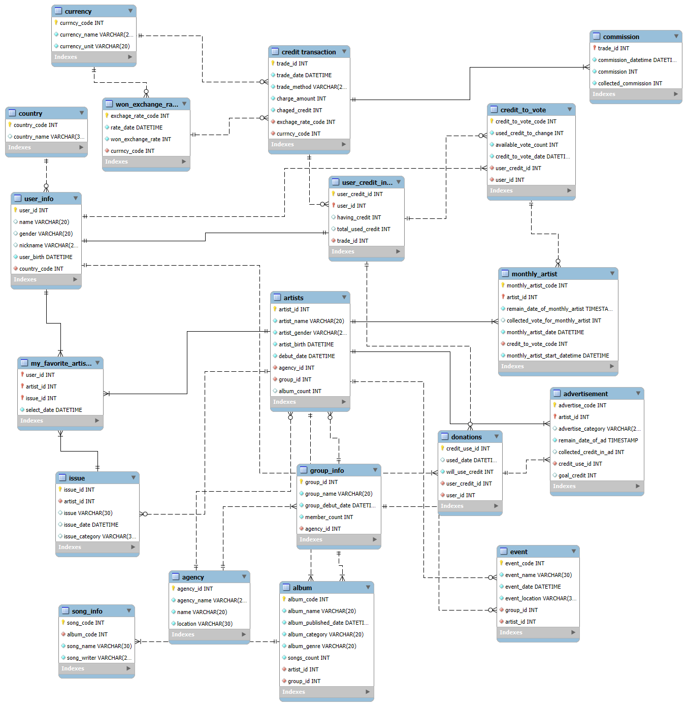

# 미션 17

## 1. ERDCloud를 통해 안내된 서비스 전체의 ERD 다이어그램을 그림


---

## 2. 작성한 ERD 다이어그램을 기반으로 직접 MySQL에 구현하기 위한 코드

```
CREATE DATABASE fandom_k;
USE fandom_k;

CREATE TABLE `currency` (
    `currncy_code` INT NOT NULL AUTO_INCREMENT,
    `currency_name` VARCHAR(20) NOT NULL,
    `currency_unit` VARCHAR(20) NOT NULL,
    PRIMARY KEY (`currncy_code`)
);

CREATE TABLE `won_exchange_rate` (
    `exchage_rate_code` INT NOT NULL AUTO_INCREMENT,
    `rate_date` DATETIME NOT NULL,
    `won_exchange_rate` INT NOT NULL,
    `currncy_code` INT NOT NULL,
    PRIMARY KEY (`exchage_rate_code`),
    FOREIGN KEY (`currncy_code`) REFERENCES `currency` (`currncy_code`)
);

CREATE TABLE `country` (
    `country_code` INT NOT NULL AUTO_INCREMENT,
    `country_name` VARCHAR(30) NULL,
    PRIMARY KEY (`country_code`)
);

CREATE TABLE `user_info` (
    `user_id` INT NOT NULL AUTO_INCREMENT,
    `name` VARCHAR(20) NULL,
    `gender` VARCHAR(20) NULL,
    `nickname` VARCHAR(20) NULL,
    `user_birth` DATETIME NOT NULL,
    `country_code` INT NOT NULL,
    PRIMARY KEY (`user_id`),
    FOREIGN KEY (`country_code`) REFERENCES `country` (`country_code`)
);

CREATE TABLE `credit transaction` (
    `trade_id` INT NOT NULL AUTO_INCREMENT,
    `trade_date` DATETIME NOT NULL,
    `trade_method` VARCHAR(20) NOT NULL,
    `charge_amount` INT NOT NULL,
    `chaged_credit` INT NOT NULL,
    `exchage_rate_code` INT NOT NULL,
    `currncy_code` INT NOT NULL,
    PRIMARY KEY (`trade_id`),
    FOREIGN KEY (`exchage_rate_code`) REFERENCES `won_exchange_rate` (`exchage_rate_code`),
    FOREIGN KEY (`currncy_code`) REFERENCES `currency` (`currncy_code`)
);

CREATE TABLE `commission` (
    `trade_id` INT NOT NULL AUTO_INCREMENT,
    `commission_datetime` DATETIME NOT NULL,
    `commission` INT NOT NULL,
    `collected_commission` INT NOT NULL,
    PRIMARY KEY (`trade_id`),
    FOREIGN KEY (`trade_id`) REFERENCES `credit transaction` (`trade_id`)
);

CREATE TABLE `agency` (
    `agency_id` INT NOT NULL AUTO_INCREMENT,
    `agency_name` VARCHAR(20) NOT NULL,
    `name` VARCHAR(20) NOT NULL,
    `location` VARCHAR(30) NOT NULL,
    PRIMARY KEY (`agency_id`)
);

CREATE TABLE `group_info` (
    `group_id` INT NOT NULL AUTO_INCREMENT,
    `group_name` VARCHAR(20) NOT NULL,
    `group_debut_date` DATETIME NOT NULL,
    `member_count` INT NOT NULL,
    `agency_id` INT NOT NULL,
    PRIMARY KEY (`group_id`),
    FOREIGN KEY (`agency_id`) REFERENCES `agency` (`agency_id`)
);

CREATE TABLE `artists` (
    `artist_id` INT NOT NULL AUTO_INCREMENT,
    `artist_name` VARCHAR(20) NOT NULL,
    `artist_gender` VARCHAR(20) NOT NULL,
    `artist_birth` DATETIME NOT NULL,
    `debut_date` DATETIME NOT NULL,
    `agency_id` INT NOT NULL,
    `group_id` INT NOT NULL,
    `album_count` INT NULL,
    PRIMARY KEY (`artist_id`),
    FOREIGN KEY (`agency_id`) REFERENCES `agency` (`agency_id`),
    FOREIGN KEY (`group_id`) REFERENCES `group_info` (`group_id`)
);

CREATE TABLE `album` (
    `album_code` INT NOT NULL AUTO_INCREMENT,
    `album_name` VARCHAR(20) NOT NULL,
    `album_published_date` DATETIME NOT NULL,
    `album_category` VARCHAR(20) NOT NULL,
    `album_genre` VARCHAR(20) NOT NULL,
    `songs_count` INT NOT NULL,
    `artist_id` INT NOT NULL,
    `group_id` INT NOT NULL,
    PRIMARY KEY (`album_code`),
    FOREIGN KEY (`artist_id`) REFERENCES `artists` (`artist_id`),
    FOREIGN KEY (`group_id`) REFERENCES `group_info` (`group_id`)
);

CREATE TABLE `song_info` (
    `song_code` INT NOT NULL AUTO_INCREMENT,
    `album_code` INT NOT NULL,
    `song_name` VARCHAR(30) NOT NULL,
    `song_writer` VARCHAR(20) NOT NULL,
    PRIMARY KEY (`song_code`),
    FOREIGN KEY (`album_code`) REFERENCES `album` (`album_code`)
);


CREATE TABLE `user_credit_info` (
    `user_credit_id` INT NOT NULL AUTO_INCREMENT,
    `user_id` INT NOT NULL,
    `having_credit` INT NULL,
    `total_used_credit` INT NULL,
    `trade_id` INT NOT NULL,
    PRIMARY KEY (`user_credit_id`),
    FOREIGN KEY (`user_id`) REFERENCES `user_info` (`user_id`),
    FOREIGN KEY (`trade_id`) REFERENCES `credit transaction` (`trade_id`)
);

CREATE TABLE `issue` (
    `issue_id` INT NOT NULL AUTO_INCREMENT,
    `artist_id` INT NOT NULL,
    `issue` VARCHAR(30) NULL,
    `issue_date` DATETIME NULL,
    `issue_category` VARCHAR(30) NULL,
    PRIMARY KEY (`issue_id`),
    FOREIGN KEY (`artist_id`) REFERENCES `artists` (`artist_id`)
);

CREATE TABLE `event` (
    `event_code` INT NOT NULL AUTO_INCREMENT,
    `event_name` VARCHAR(30) NOT NULL,
    `event_date` DATETIME NOT NULL,
    `event_location` VARCHAR(30) NOT NULL,
    `group_id` INT NOT NULL,
    `artist_id` INT NOT NULL,
    PRIMARY KEY (`event_code`),
    FOREIGN KEY (`group_id`) REFERENCES `group_info` (`group_id`),
    FOREIGN KEY (`artist_id`) REFERENCES `artists` (`artist_id`)
);

CREATE TABLE `my_favorite_artists` (
    `user_id` INT NOT NULL,
    `artist_id` INT NOT NULL,
    `issue_id` INT NOT NULL,
    `select_date` DATETIME NOT NULL,
    PRIMARY KEY (`user_id`, `artist_id`, `issue_id`),
    FOREIGN KEY (`user_id`) REFERENCES `user_info` (`user_id`),
    FOREIGN KEY (`artist_id`) REFERENCES `artists` (`artist_id`),
    FOREIGN KEY (`issue_id`) REFERENCES `issue` (`issue_id`)
);

CREATE TABLE `donations` (
    `credit_use_id` INT NOT NULL AUTO_INCREMENT,
    `used_date` DATETIME NULL,
    `will_use_credit` INT NOT NULL,
    `user_credit_id` INT NOT NULL,
    `user_id` INT NOT NULL,
    PRIMARY KEY (`credit_use_id`),
    FOREIGN KEY (`user_credit_id`) REFERENCES `user_credit_info` (`user_credit_id`),
    FOREIGN KEY (`user_id`) REFERENCES `user_info` (`user_id`)
);

CREATE TABLE `credit_to_vote` (
    `credit_to_vote_code` INT NOT NULL AUTO_INCREMENT,
    `used_credit_to_change` INT NOT NULL,
    `available_vote_count` INT NOT NULL,
    `credit_to_vote_date` DATETIME NOT NULL,
    `user_credit_id` INT NOT NULL,
    `user_id` INT NOT NULL,
    PRIMARY KEY (`credit_to_vote_code`),
    FOREIGN KEY (`user_credit_id`) REFERENCES `user_credit_info` (`user_credit_id`),
    FOREIGN KEY (`user_id`) REFERENCES `user_info` (`user_id`)
);

CREATE TABLE `monthly_artist` (
    `monthly_artist_code` INT NOT NULL AUTO_INCREMENT,
    `artist_id` INT NOT NULL,
    `remain_date_of_monthly_artist` TIMESTAMP NOT NULL,
    `collected_vote_for_monthly_artist` INT NULL,
    `monthly_artist_date` DATETIME NOT NULL,
    `credit_to_vote_code` INT NOT NULL,
    `monthly_artist_start_datetime` DATETIME NOT NULL,
    PRIMARY KEY (`monthly_artist_code`, `artist_id`),
    FOREIGN KEY (`artist_id`) REFERENCES `artists` (`artist_id`),
    FOREIGN KEY (`credit_to_vote_code`) REFERENCES `credit_to_vote` (`credit_to_vote_code`)
);


CREATE TABLE `advertisement` (
    `advertise_code` INT NOT NULL AUTO_INCREMENT,
    `artist_id` INT NOT NULL,
    `advertise_category` VARCHAR(20) NULL,
    `remain_date_of_ad` TIMESTAMP NOT NULL,
    `collected_credit_in_ad` INT NULL,
    `credit_use_id` INT NOT NULL,
    `goal_credit` INT NULL,
    PRIMARY KEY (`advertise_code`, `artist_id`),
    FOREIGN KEY (`artist_id`) REFERENCES `artists` (`artist_id`),
    FOREIGN KEY (`credit_use_id`) REFERENCES `donations` (`credit_use_id`)
);

```

### 2-1 참고 링크

참고링크 :

- https://velog.io/@psj0810/MySQL-Workbench%EB%A1%9C-ERD%EB%8B%A4%EC%9D%B4%EC%96%B4%EA%B7%B8%EB%9E%A8-%EC%83%9D%EC%84%B1

---

### 3. MySQL Workbench (혹은 사용하고 있는 DB Tool)에서 구현한 데이터베이스의 ERD를 확인 및 비교


